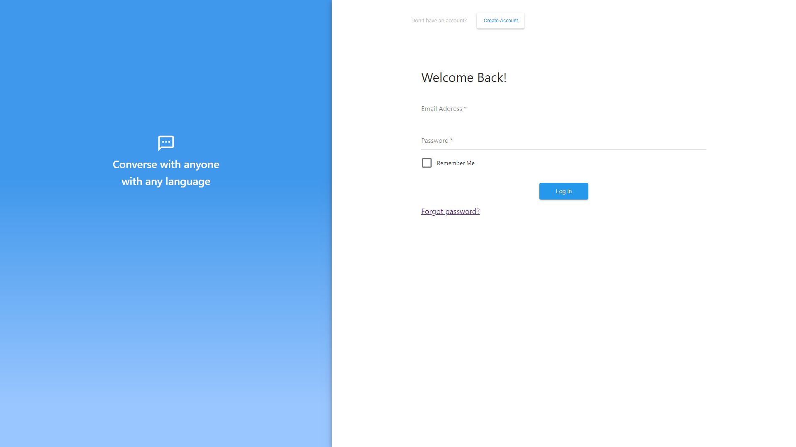

# Team Mint Oreo: Babl <!-- omit in toc -->

**_Table of Contents:_**

- [Preview](#preview)
- [About](#about)
- [Authors](#authors)
- [Setup Guide](#setup-guide)
	- [Prerequisites](#prerequisites)
	- [Getting Started](#getting-started)

# Preview

This project is currently live at https://babl-babl.herokuapp.com/



# About

Babl: The messaging app with built in translation. Have you ever had trouble communicating with someone in a foreign language? Fear not, Babl is here.

Babl automatically translates text messages sent from your friends to your native language. No matter what language they speak, you will have a translation to your primary language.

**Tech Stack**

MERN (Mongo, Express, React, Node)

| Other Technology Highlights |
| :-------------------------: |
|         material-ui         |
|          socket.io          |
| googleapis/nodejs-translate |
|         aws-sdk-js          |

# Authors

Built by [Jimmy](https://github.com/Rocket-Fish), [Brian](https://github.com/brianqian), and [Sang min](https://github.com/slee288)

# Setup Guide

## Prerequisites

In order to run this project locally you **must** have [node.js](https://nodejs.org/en/) installed.

This project was built on the following node version.

```bash
$ node --version
v10.15.3
```

You must also create a `.env` file with the following variables:

```bash
# randomly generated
JWT_SECRET=" "
COOKIE_SECRET=" "

# obtained from sendgrid
SENDGRID_API_KEY=" "

# obtained from mongoDB
MONGO_URI=" "
MONGO_URI_TEST=" "

#obtained from AWS
AWS_ID=" "
AWS_SECRET=" "
AWS_BUCKET_NAME=" "

# obtained from google apis
GOOGLE_APPLICATION_CREDENTIALS="google_api_crednetials.json"
```

If any of the above environment variables are missing the project will loose functionality or even fail to run.

If you are just here for a demo this project is live at: https://babl-babl.herokuapp.com/

## Getting Started

```bash
git clone https://github.com/hatchways/team-mint-oreo.git
```

```bash
cd team-mint-oreo\server
```

Paste your `.env` file and `google_api_crednetials.json` file here.

Now go back to your root directory of the project (one folder above).

```bash
cd ..
```

```bash
npm run installation
```

```bash
npm run dev
```
